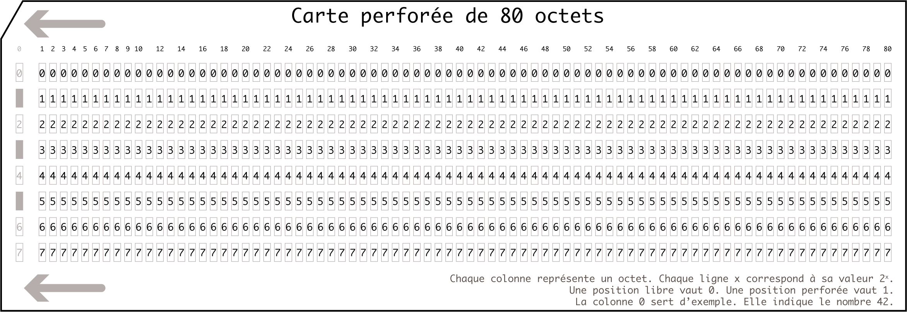

(ens:repinfo:carteperforee)=
# Carte perforée

Une forme de stockage des données permanente des ordinateurs primitifs prenait la forme d'une carte de papier épais dans laquelle 
des positions préétablies permettaient d'enregistrer les valeurs des bits sous la forme de trous (pour les valeurs 1) 
ou l'absence de trous (pour les valeurs 0).
Un lecteur de cartes perforées permettait de lire relativement rapidement (pour l'époque…) des données en mémoire pour les manipuler.

Encoder, sur la carte perforée, son prénom (et nom) en ASCII, sa date de naissance, son adresse, le tout (possible ?)...

[Version PDF](https://github.com/edunumsec2/book/raw/2e886527094630cbe0259d4c0849b92077aa0a00/src/ens/rep-info/exo/media/carte-perforee.pdf)

Voilà un {download}`lien vers la version PDF<media/carte-perforee.pdf>`

[Version PDF 4x](https://github.com/edunumsec2/book/raw/2e886527094630cbe0259d4c0849b92077aa0a00/src/ens/rep-info/exo/media/carte-perforee_4x.pdf)